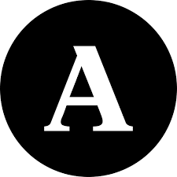

```{r setup, include=FALSE}
knitr::opts_chunk$set(echo = FALSE)

# Learn more about creating websites with Distill at:
# https://rstudio.github.io/distill/website.html

```

**Bem vindos/as!**

Este é o site da disciplina "**direito internacional público**", do 3º semestre do bacharelado em direito da Universidade Zumbi dos Palmares

## Informações básicas

- **Período:** segundo semestre, 2025
- **Sala:** 1 - Mano Brown
- **Horários:**
  - segundas, 21h00-22h35
  - sextas, 21h00-22h35
- **Professor:** Luccas Gissoni

## Apresentação

O direito internacional público é aquele que regula as **relações** em que adentram os **Estados e organizações internacionais**. Sua estrutura lógica é semelhante ao do direito interno, mas repousa sobre fundamentos distintos. Neste curso, vamos fazer uma breve introdução ao seu funcionamento.

### Objetivos

O curso visa proporcionar uma compreensão aprofundada dos princípios e normas que regem as relações internacionais. Os alunos desenvolverão habilidades analíticas para interpretar tratados, compreender a atuação de organizações internacionais e avaliar criticamente a aplicação do Direito Internacional em diferentes contextos.

### Metodologia

O curso contará com **aulas expositivas** e momentos de reflexão individual e **produção textual** a partir do material bibliográfico fornecido.

### Bibliografia

```{r}
#biblio <- bibtex::read.bib("biliografia.bib")
#utilizar abaoxo
#`r capture.output(print(biblio["brasil_constituicao_1988"]))`
```


#### Bibliografia básica

- @brasil_decreto_1945  
- @brasil_decreto_2009  
- @rezek_direito_2025  

#### Bibliografia complementar

- @accioly_manual_2019  
- @accioly_manual_2023  
- @brasil_constituicao_1988  
- @chimni_outline_2008  
- @gaeta_casseses_2020  
- @gonzalez_hauck_public_2024  
- @grieco_introduction_2015  
- @fukuyama_end_1989  
- @shaw_international_2021  

### Referências Adicionais

Os alunos podem consultar materiais complementares nos seguintes sites:  
- [ONU - Tratados](https://treaties.un.org/)  
- [Corte Internacional de Justiça](https://www.icj-cij.org/)  

## Estrutura do curso

### Aulas, leituras e materiais

Teremos momentos de aulas expositivo-dialogadas em que discutiremos a bibliografia do curso. Neste site, também estarão disponíveis as notas de aula, elaboradas pelo professor, que servirão de material de apoio. **A leitura de ambos os materiais é obrigatória**.

### Avaliação

#### Tipos de avaliação

A avaliação será dividida em dois bimestres, cada um dos quais contará com uma prova de avaliação prática (**PAP**) valendo **3 pontos** e uma prova de avaliação teórica (**PAT**), valendo **7 pontos**. A nota final será a **média aritmética dos dois bimestres** e haverá possibilidade de realização de prova substitutiva (**SUB**) e **exame**. 

##### PAP

As PAP constituirão duas **atividades ou trabalhos escritos individuais**, uma por bimestre. Cada uma valerá **3 pontos**. As PAP serão realizadas em sala.

##### PAT e SUB

As PAT serão constituídas por cinco **questões objetivas** valendo **5 pontos** e uma ou duas **questões dissertativas** valendo **2 pontos**. A SUB terá a mesma estrutura. Todas serão baseadas na experiência de prova do Exame de Ordem e do ENADE.

##### Exame

O Exame será composto por sete **questões objetivas** valendo **7 pontos** e duas ou três **questões dissertativas** valendo **3 pontos**.

#### Critérios de Avaliação

As avaliações serão avaliadas com base nos seguintes critérios:

- Clareza e coerência argumentativa

- Precisão conceitual e fundamentação jurídica

- Originalidade da análise e uso de referências adequada

#### Fórmula de cálculo da nota

A média para aprovação no curso é de **6 pontos**. Caso não a alcance mediante a realização das avaliações ordinárias (PAP, PAT e, caso necessário, SUB), podem ocorrer as seguintes situações:

- Se o/a estudante obtiver, no mínimo **3 pontos**, terá a oportunidade de avaliação extraordinária através do **exame** 

- Se o/a estudante obtiver média inferior a **3 pontos**, estará automaticamente reprovado/a

##### Nota bimestral

A nota bimestral é simplesmente a soma das notas da PAP e da PAT:

$$\text{Nota Bimestral} = \text{Nota PAP} + \text{Nota PAT} $$

##### Média semestral

A média do curso é a média aritmética simples das notas dos dois bimestres: 

$$\text{Média Semestral} = \frac{\text{Nota Bimestre 1} + \text{Nota Bimestre 2}}{2} $$
**Situações:**

- Se a **Média Semestral** for, no mínimo, **6 pontos**, o estudante está aprovado/a
- Se a **Média Semestral** for, no mínimo, **3 pontos**, mas inferior a **6**, o estudante terá a oportunidade de avaliação extraordinária através do **exame**
- Se a **Média Semestral** for inferior a **3 pontos**, o estudante estará automaticamente reprovado/a 

##### Nota final

A nota final, caso o estudante faça o exame, é a média aritmética simples entre a Média Final do semestre e a nota do Exame: 

$$\text{Nota Final} = \frac{\text{Média Semestral} + \text{Nota Exame}}{2} $$

**Observação:** A média para aprovação no exame é de **5 pontos**.

## Plágio e uso indevido de IA em atividades acadêmicas

O compromisso com a **autenticidade e integridade acadêmica** é essencial para seu aprendizado e desenvolvimento profissional. O uso indevido de **inteligência artificial (IA)** e a prática de **plágio** comprometem esse princípio e terão **consequências rigorosas**.


### Plágio

De acordo com o **art. 184** do **Código Penal** e normas acadêmicas, **apresentar como sua uma produção intelectual alheia, sem a devida citação, configura plágio**. Isso inclui:  

- Copiar trechos de livros, artigos, sites ou outros trabalhos sem a devida referência;  
- Parafrasear um texto sem indicar a fonte;  
- Apresentar como próprio um trabalho feito por terceiros. 

<div class="warning">
  <p>⚠️ Atenção </p>
  <p> As atividades plagiadas serão anuladas e atribuídas nota zero.
  </p>
</div>

### Uso de inteligência artificial  

Ferramentas de IA podem auxiliar na pesquisa, mas **não substituem a construção do conhecimento próprio**. O uso de IA para gerar respostas prejudica sua autonomia acadêmica e seu preparo para avaliações futuras, como o **Exame de Ordem** e o **ENADE**, onde tais ferramentas não estarão disponíveis.  

<div class="warning">
  <p>⚠️ Atenção </p>
  <p> A identificação do uso não autorizado de IA resultará na anulação da atividade e atribuição de nota zero.
  </p>
</div>

### Como garantir a originalidade do seu trabalho?

- Desenvolva suas respostas com base no material estudado e em sua própria reflexão;  
- Utilize fontes acadêmicas confiáveis e cite corretamente todas as referências;  
- Se tiver dúvidas sobre citação e integridade acadêmica, consulte o professor antes de entregar o trabalho.  

### Conscientização e compromisso  

A universidade valoriza a **produção autoral e o pensamento crítico**. O objetivo das atividades acadêmicas é fortalecer suas habilidades de argumentação, escrita e análise, que serão essenciais para sua trajetória profissional.  

 **Seja responsável pelo seu aprendizado!** Trabalhos autênticos refletem seu crescimento e garantem que você esteja verdadeiramente preparado para os desafios da carreira jurídica.  

#### 📬 Dúvidas? Entre em contato!  

Todo contato pode ser estabelecido através e-mail [**luccas.gissoni@gmail.com**](mailto:luccas.gissoni@gmail.com) ou durante os horários das aulas.

## Sobre o professor

Possui graduação em Direito pela Universidade de São Paulo (2015), graduação em Filosofia pela Pontifícia Universidade Católica de São Paulo (2012) e mestrado em Economia Política Mundial pela Universidade Federal do ABC (2020). No momento, está no doutorado também por este mesmo programa. É pós-graduado em Processo Civil pela Fundação Getulio Vargas (2019). Atualmente é Professor de Direito na Universidade Zumbi dos Palmares, Analista de Políticas Públicas e Gestão Governamental na Secretaria Municipal de Mobilidade Urbana e Trânsito da Prefeitura de São Paulo e professor voluntário na Uneafro. Constrói o projeto "Novo Bandung: grupo de estudos sobre descolonização e emergência do Sul: África, Ásia e América Latina" na UFABC, bem como a Agrarian South Network, em Harare, Zimbábue, desenvolvendo pesquisa sobre a formação econômica e social do Brasil e da China. Foi coordenador de direito econômico e economia política da Comissão de Graduação, Pós-Graduação e Pesquisa da OAB/SP. Tem experiência nas áreas de Economia Política Mundial, Planejamento de Transportes, Filosofia e Direito, atuando principalmente nos seguintes temas: história econômica, teoria geral do direito, formação econômica e social do Brasil, história da África, desenvolvimento econômico e geopolítica na Ásia, segurança viária e planejamento cicloviário. Advogado em São Paulo.


### Perfis acadêmicos e redes sociais

{ width=2.5% } [Lattes](http://lattes.cnpq.br/3169916414077985)  
<i class="fa-brands fa-orcid"></i> [ORCID](https://orcid.org/0000-0003-3564-6269)  
<i class="fa-brands fa-researchgate"></i> [ResearchGate](https://www.researchgate.net/profile/Luccas-Gissoni?ev=hdr_xprf)  
{ width=2.25% } [Academia.edu](https://ufabc-br.academia.edu/LuccasGissoni)  
<i class="fa-brands fa-github"></i> [GitHub](https://github.com/lgissoni)  
<i class="fa-brands fa-square-twitter"></i> [Twitter](https://x.com/luccas_loki)  
