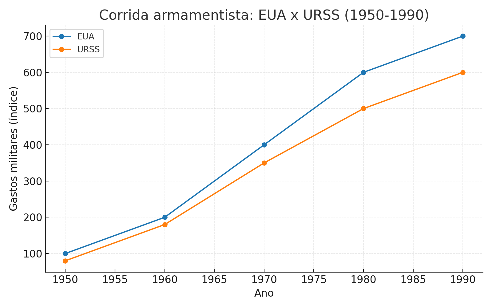

# Breve introdução à teoria das Relações Internacionais

O estudo das teorias das Relações Internacionais (RI) é essencial para compreender como os Estados e demais atores interagem no cenário global. As teorias não são simples reflexos da realidade, mas lentes interpretativas que organizam a complexidade da política mundial. Cada tradição teórica seleciona variáveis, define prioridades e, a partir de pressupostos centrais, busca explicar padrões de comportamento internacional.

> “Cada uma dessas tradições teóricas atribui diferentes níveis de importância aos aspectos fundamentais para a compreensão das relações internacionais. Cada uma estabelece uma série de pressupostos e, a partir deles, direciona a atenção para diferentes forças motrizes a fim de dar sentido à complexidade da política mundial. Realistas e construtivistas, ou liberais e marxistas, observam o mesmo mundo, mas cada um enfatiza aspectos muito distintos ou, mais precisamente, mecanismos causais diferentes para compreendê-lo” [@grieco_introduction_2015, p. 71, tradução nossa].

As duas tradições mais influentes no século XX foram o **realismo** e o **liberalismo**. A seguir, analisaremos seus pressupostos, proposições e implicações.

## Realismo

Para os realistas, as Relações Internacionais são uma competição entre Estados por poder e segurança em um sistema internacional **anárquico**, ou seja, desprovido de autoridade superior capaz de impor regras e resolver conflitos. Essa condição torna inevitáveis a competição e, em última instância, a guerra.

### Pressupostos do Realismo

1. **Anarquia internacional:** Não existe autoridade central acima dos Estados. A política internacional é marcada pela ausência de um governo mundial.
2. **Estados como atores centrais:** São os principais detentores de poder e responsáveis por garantir sua própria sobrevivência. Organizações internacionais e atores não estatais são relevantes, mas secundários.
3. **Racionalidade:** Estados agem de forma racional, calculando custos e benefícios de suas decisões.
4. **Segurança como objetivo central:** O problema fundamental da política internacional é a sobrevivência do Estado.
5. **Jogo de soma zero:** A busca por segurança gera competição, pois o ganho de poder por um Estado implica perda relativa para outro.

### Proposições do Realismo

1. **Balanço de poder:** A dinâmica básica das RI é o equilíbrio entre Estados. Se um se fortalece, os outros reagem formando alianças ou aumentando seu poder.
2. **Dilema da segurança:** A incerteza sobre as intenções alheias leva à corrida armamentista.
3. **Ganhos relativos:** Importa mais o quanto um Estado ganha em relação aos outros do que ganhos absolutos.
4. **Transições de poder:** Mudanças na hierarquia internacional são momentos críticos, com risco de guerra.
5. **Nacionalismo:** Força mobilizadora essencial para manter a coesão interna e justificar sacrifícios em prol da segurança.

```{r}

```

## Liberalismo

O liberalismo destaca que, embora haja conflito, a cooperação também é possível e tem crescido historicamente. Essa tradição enfatiza a importância das instituições, da interdependência econômica e da expansão da democracia.

### Pressupostos do Liberalismo

1. **Progresso histórico:** Diferente do realismo, que vê a história como cíclica, o liberalismo aposta na possibilidade de evolução rumo à paz e à cooperação.
2. **Pluralidade de atores:** Indivíduos, empresas, ONGs e instituições internacionais também moldam as RI, e não apenas os Estados.
3. **Tendência à cooperação:** A interdependência econômica e os incentivos sociais favorecem a superação de conflitos.
4. **Difusão da democracia e do mercado:** A modernização leva as sociedades em direção à democracia liberal e à economia de mercado.
5. **Normas e direito internacional:** Regras compartilhadas e instituições podem reduzir a incerteza e fomentar a cooperação.

### Proposições do Liberalismo

1. **Interdependência econômica:** O comércio cria custos para a guerra, favorecendo a paz (liberalismo comercial).
2. **Paz democrática:** Democracias dificilmente guerreiam entre si, pois compartilham valores e possuem mecanismos internos de controle popular.
3. **Instituições internacionais:** Organizações e normas internacionais estabelecem previsibilidade, reduzem incertezas e incentivam a cooperação.

> “Quando os Estados concordam em seguir um conjunto de regras e instituições, eles aceitam limitar sua liberdade de ação. Os liberais argumentam que os Estados escolhem se vincular a acordos institucionais quando isso cria incentivos e obrigações para que outros Estados façam o mesmo” [@grieco_introduction_2015, p. 84, tradução nossa].

```{r}

```

## Comparação crítica

| Aspecto               | Realismo                                      | Liberalismo                                  |
|-----------------------|----------------------------------------------|---------------------------------------------|
| **Atores principais** | Estados                                      | Indivíduos, grupos, Estados               |
| **Natureza do sistema**| Anárquico, conflito inevitável              | Anárquico, mas cooperação possível         |
| **Meta principal**    | Segurança e sobrevivência                   | Paz, cooperação e prosperidade            |
| **Visão da história** | Cíclica, repetição de guerras               | Linear, progresso possível                |
| **Instituições**      | Pouca relevância                             | Centrais para promover cooperação          |

<div class="warning">
<strong>Para saber mais:</strong><br>
GRIECO, Joseph; IKENBERRY, G. John; MASTANDUNO, Michael. *Introduction to International Relations:* Enduring Questions and Contemporary Perspectives. 2. ed. New York: Palgrave Macmillan, 2015.<br>
JACKSON, Robert; SORENSEN, Georg. *Introdução às Relações Internacionais:* teorias e abordagens. Rio de Janeiro: Zahar, 2013.<br>
WALTZ, Kenneth. *Theory of International Politics*. New York: McGraw-Hill, 1979.
</div>

---

# Perguntas para reflexão

1. O dilema da segurança ainda explica as relações entre EUA e China no século XXI?
2. A interdependência econômica impede a guerra? Analise o caso da Rússia e da União Europeia em 2022.
3. As instituições internacionais são eficazes em um mundo dominado por grandes potências?

---

# Atividade prática

Forme grupos e simule uma negociação entre dois Estados com interesses conflitantes:
- Um grupo deve adotar a perspectiva **realista**, priorizando segurança.
- Outro grupo deve adotar a perspectiva **liberal**, propondo mecanismos de cooperação.
Depois, debatam os resultados: qual abordagem foi mais convincente?
