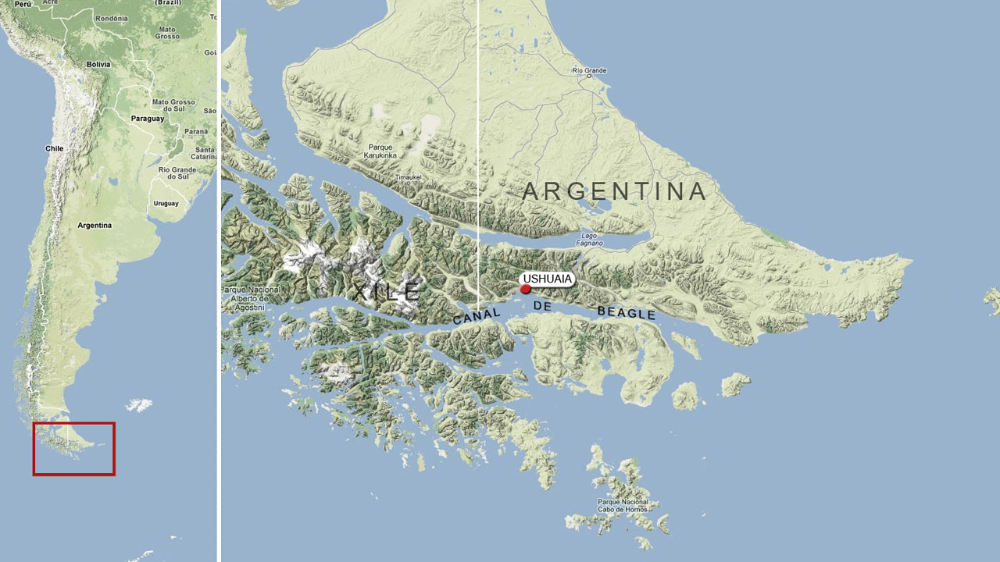
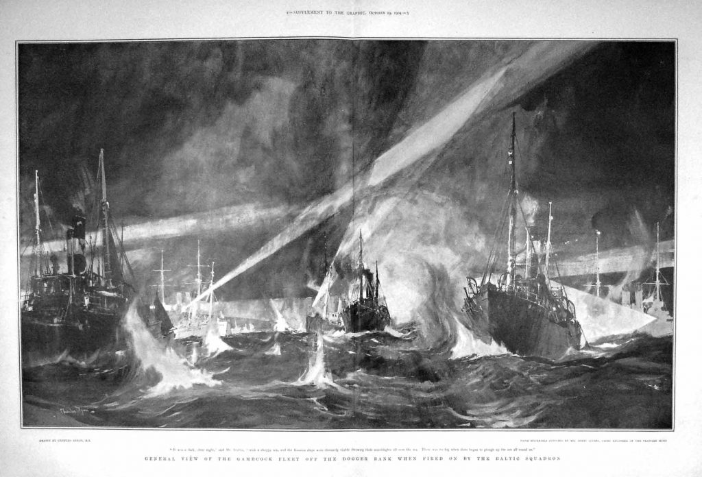

# Introdução

A pacificação das controvérsias é uma das finalidades permanentes do Direito Internacional. A Carta das Nações Unidas, em seu Art. 2º, §3º, impõe aos Estados o dever de buscar meios pacíficos para resolver suas disputas, afastando o uso da força. O desenvolvimento desses mecanismos acompanha a própria história da sociedade internacional.

Segundo Rezek, “o aparecimento de mecanismos pacíficos acompanha a própria história do direito internacional” [@rezek_direito_2024, p. 443], e sua evolução está ligada à tentativa de civilizar o conflito entre Estados. Como observa Shaw, o sistema contemporâneo reconhece uma pluralidade de instrumentos, mas ainda depende, em larga medida, da vontade soberana dos Estados [@shaw_international_2021].

Nesta aula, exploramos os **meios diplomáticos, políticos e jurisdicionais** previstos pelo Direito Internacional. Além da exposição técnica, incluímos também o debate crítico sobre sua efetividade e seus limites, com apoio nas doutrinas de Cassese, Chimni, Gaeta, Shaw, Rezek e Accioly, bem como a abordagem crítica das *Third World Approaches to International Law* (TWAIL), ou "Abordagens do Terceiro Mundo para o Direito Internacional".

# Meios diplomáticos e políticos

## Entendimento direto

A forma mais primária e desformalizada de solução pacífica. Duas partes, sem intermediação de terceiros, buscam ajustar suas posições por meio do diálogo bilateral, seja por canais diplomáticos ou políticos. Em termos jurídicos, caracteriza-se por ser um procedimento voluntário, flexível e não institucionalizado.

Esse tipo de mecanismo pode assumir a forma de reuniões de cúpula, notas diplomáticas, visitas de chefes de Estado ou ministros, e acordos informais.

> “O entendimento direto traduz a soberania dos Estados ao permiti-los resolver seus desacordos sem sujeição a qualquer fórmula institucional ou decisão heterônoma.”  
> [@accioly_manual_2023, p. 445]

Contudo, como observa Gaeta, essa informalidade pode levar à perpetuação da desigualdade nas relações interestatais, sobretudo entre países do Norte e do Sul global [@gaeta_casseses_2020].

## Bons ofícios

São definidos como a atuação de um terceiro — geralmente um Estado, organização internacional ou figura pública — que busca aproximar as partes e criar as condições iniciais para o diálogo. Os bons ofícios não envolvem a proposição de soluções, mas apenas o estímulo à negociação.

> “Os bons ofícios representam uma forma de intervenção discreta e não vinculante, respeitando a soberania dos Estados e promovendo a autodeterminação na resolução de conflitos" [@accioly_manual_2023, p. 447].

### Exemplo: Indonésia e o processo de independência de Timor-Leste

Durante os anos 1990, a Indonésia, sob crescente pressão internacional, aceitou mediação da ONU e envolvimento de Portugal como potência administradora, até que se formalizasse o referendo que levou à independência timorense em 2002. A atuação da ONU nesse período combinou bons ofícios com supervisão política e institucional, conforme reconhecido na Resolução 1246 do Conselho de Segurança.

  
<b>Para saber mais: a trajetória do Timor-Leste e o papel da ONU</b>

  
  
Timor-Leste foi uma colônia portuguesa até 1975. Após breve declaração de independência, foi invadido e anexado pela Indonésia, que passou a administrá-lo como província. "A invasão indonésia do Timor-Leste, conhecida na Indonésia como <b>Operação Lótus</b> (indonésio: *Operasi Seroja*), começou em 7 de dezembro de 1975, quando as forças armadas da Indonésia invadiram o território sob o pretexto de combater o colonialismo e o comunismo, com o objetivo de derrubar o governo da Fretilin, que havia emergido em 1974. A derrubada desse governo, popular e de curta duração, liderado pela Fretilin, desencadeou uma ocupação violenta que durou um quarto de século, na qual se estima que entre 100.000 e 180.000 soldados e civis tenham sido mortos ou tenham morrido de fome" [@noauthor_indonesian_2025].
  

  

  Durante os anos 1990, a situação em Timor-Leste ganhou atenção internacional crescente. Após intensas negociações mediadas pela ONU, Indonésia e Portugal assinaram, em 5 de maio de 1999, os Acordos de Nova York, que previam a realização de uma <b>consulta popular</b> sobre o futuro do território — entre autonomia especial sob soberania indonésia ou separação com vistas à independência.
  

  

  A Indonésia, sob o governo de B. J. Habibie, assumiu formalmente a posição de aceitar os bons ofícios da ONU e o princípio da autodeterminação, condicionando sua atuação à manutenção da paz e da ordem pública durante o processo. Essa aceitação representou um marco na política externa do país, rompendo com a posição anterior de integração definitiva de Timor-Leste ao seu território.
  

  

  A <b>Resolução 1246 (1999)</b> do Conselho de Segurança estabeleceu a <b>Missão das Nações Unidas em Timor-Leste (UNAMET)</b> com mandato até 31 de agosto de 1999, encarregada de organizar e conduzir a consulta popular agendada para 8 de agosto. A missão foi composta por:
  

  <ul>
    <li>280 policiais civis para assessorar e supervisionar a atuação da polícia indonésia;</li>
    <li>50 oficiais militares de ligação para manter comunicação com as forças armadas indonésias;</li>
    <li>componentes político, eleitoral e informativo voltados à garantia de um pleito justo e esclarecido.</li>
  </ul>

  

  A resolução reafirmou o compromisso da ONU com uma solução pacífica e enfatizou a <b>responsabilidade da Indonésia</b> em garantir segurança, desarmar milícias, assegurar liberdade política e preservar a integridade do processo. A consulta resultou na rejeição da autonomia e na posterior independência de Timor-Leste.
  

  

    🔗 <a href="https://undocs.org/S/RES/1246(1999)" target="_blank">Texto completo da Resolução 1246 (1999)</a>
  

## Sistema de consultas

Esse meio aparece especialmente no campo econômico e comercial. Está previsto em diversos tratados internacionais como mecanismo preventivo de litígios.

> “Os sistemas de consultas diplomáticas visam esgotar canais bilaterais antes da abertura de um contencioso institucional”  
> [@rezek_direito_2024, p. 449]

### Exemplo: OMC

A Organização Mundial do Comércio (OMC) exige, como etapa preliminar antes do contencioso formal, que as partes realizem consultas sob supervisão do Órgão de Solução de Controvérsias. Muitas disputas são solucionadas já nessa fase.

  
<b>Texto complementar – sistema de consultas da OMC:</b>

  

  O objetivo preferencial do Entendimento sobre Solução de Controvérsias (DSU) é que os Membros envolvidos resolvam a controvérsia entre si de maneira compatível com o Acordo da OMC (Artigo 3.7 do DSU). Assim, as consultas bilaterais entre as partes constituem a primeira etapa do processo formal de solução de controvérsias (Artigo 4). Elas oferecem às partes a oportunidade de discutir a questão e encontrar uma solução satisfatória sem recorrer à litigância (Artigo 4.5). Somente após tais consultas obrigatórias fracassarem — isto é, não produzirem solução satisfatória dentro de 60 dias — é que o reclamante pode solicitar a criação de um painel (Artigo 4.7). Mesmo quando as consultas não resolvem a controvérsia, permanece possível às partes encontrar uma solução mutuamente acordada em qualquer fase posterior do processo.
  

  

  A maioria das controvérsias na OMC até hoje não passou da fase de consultas, seja porque se chegou a um acordo satisfatório, seja porque o reclamante decidiu, por outros motivos, não dar prosseguimento. Isso demonstra que as consultas são frequentemente um meio eficaz de resolução de disputas na OMC e que os instrumentos de adjudicação e execução nem sempre são necessários.
  

  

  Juntamente com os bons ofícios, a conciliação e a mediação (Artigo 5), as consultas são o elemento não jurisdicional/diplomático central do sistema de solução de controvérsias da OMC. Elas também permitem que as partes esclareçam os fatos e as alegações, o que pode desfazer mal-entendidos quanto à natureza da medida contestada. Nesse sentido, as consultas podem tanto abrir caminho para um acordo quanto preparar o terreno para fases subsequentes do DSU.
  

  

  O pedido de consultas inicia formalmente uma controvérsia na OMC e aciona a aplicação do DSU. Frequentemente, ocorrem discussões informais entre autoridades nacionais ou delegações em Genebra antes do pedido formal. No entanto, mesmo que essas tratativas anteriores existam, é obrigatório que o reclamante siga o procedimento formal de consultas previsto no DSU como condição para dar prosseguimento.
  

  

  O Membro reclamante dirige o pedido ao Membro respondente, devendo também notificá-lo ao Órgão de Solução de Controvérsias (DSB) e aos conselhos e comitês relevantes que supervisionam o(s) acordo(s) envolvidos (Artigo 4.4). Basta enviar um único texto à Secretaria, que o distribui aos órgãos pertinentes. O pedido deve indicar as medidas contestadas e a fundamentação jurídica da reclamação. Na prática, esses pedidos são curtos (1 ou 2 páginas), mas devem ser suficientemente claros. Eles recebem a sigla oficial WT/DS###/1.
  

  

  Sob o GATT 1994 (e acordos correlatos), há duas possíveis bases jurídicas para iniciar uma disputa: o Artigo XXII:1 ou o Artigo XXIII:1. O mesmo se aplica ao GATS. A principal diferença prática entre essas bases está na possibilidade de terceiros interessados se juntarem às consultas: se baseadas no Art. XXII, terceiros podem participar, mediante aceitação do respondente; se baseadas no Art. XXIII, o reclamante pode impedir a participação de terceiros, tornando essa opção mais atrativa quando deseja negociar diretamente com o respondente.
  

  

  Antes de iniciar consultas, um Membro da OMC deve exercer seu juízo político sobre a conveniência de acionar o sistema, considerando que o objetivo do DSU é assegurar soluções positivas para as disputas (Artigo 3.7). Ou seja, cabe ao Membro decidir se vale a pena propor o caso, assumindo essa responsabilidade autorregulatória.
  

  

    Fonte: <a href="https://www.wto.org/english/tratop_e/dispu_e/disp_settlement_cbt_e/c6s2p1_e.htm" target="_blank">WTO – Dispute Settlement System: Consultations</a>. Tradução livre.
  

## Mediação

A mediação implica um papel mais ativo do terceiro, que propõe soluções, formula termos e atua como intermediador substancial entre os Estados. Esse mecanismo é especialmente eficaz quando as partes estão dispostas a considerar propostas externas para resolver suas divergências.

> “A mediação é uma forma de intervenção diplomática que busca facilitar a comunicação entre as partes e propor soluções mutuamente aceitáveis, respeitando a soberania dos Estados envolvidos” [@shaw_international_2021, p. 1023].

### Exemplo: Canal de Beagle

A mediação do Papa João Paulo II foi decisiva para resolver a disputa entre Argentina e Chile sobre a soberania das ilhas Picton, Lennox e Nueva (1978–1984). A iminência do conflito armado foi evitada por meio de negociações sob patrocínio da Santa Sé, culminando no Tratado de Paz e Amizade.

  
<b>Para saber mais: o caso do Canal de Beagle</b>

  
O <b>Conflito do Beagle</b> foi uma disputa territorial entre Argentina e Chile sobre a soberania das ilhas Picton, Lennox e Nueva. Em 1977, um laudo arbitral internacional atribuiu as ilhas ao Chile, mas a Argentina rejeitou a decisão e mobilizou forças armadas para contestar o resultado.

  
Em dezembro de 1978, os dois países estavam à beira de um confronto armado. Para evitar o conflito, aceitaram a <b>mediação da Santa Sé</b>, conduzida pelo Papa João Paulo II e pelo cardeal Antonio Samorè. O processo levou à assinatura do <b>Tratado de Paz e Amizade</b>, em 1984, no Vaticano, que fixou as fronteiras e instituiu mecanismos permanentes de solução pacífica entre os países.

  
Esse episódio é considerado um exemplo paradigmático de mediação internacional bem-sucedida, especialmente por envolver atores religiosos como mediadores em uma disputa interestatal.

  

    🔗 <a href="https://www.vaticannews.va/pt/vaticano/news/2024-11/aniversario-40-anos-tratado-paz-canal-beagle-argentina-chile-24.html" target="_blank">Leia mais sobre o tratado no Vatican News</a>
  

## Conciliação

A conciliação consiste na constituição de uma comissão mista que analisa os fatos, ouve as partes, e formula uma proposta de solução — sem caráter vinculante. É um mecanismo que busca combinar elementos do inquérito e da mediação, oferecendo uma solução baseada em uma análise imparcial dos fatos.

> “A conciliação é um meio termo entre a mediação e a arbitragem, oferecendo uma solução recomendada, mas não obrigatória, baseada em uma análise detalhada dos fatos e argumentos apresentados pelas partes” [@gaeta_casseses_2020, p. 512].

### Exemplo: Comissão de Conciliação Brasil-França (1930)

Nos anos 1930, Brasil e França enfrentaram um litígio sobre nacionalidade. Para resolver a controvérsia, foi estabelecida uma Comissão de Conciliação Brasil-França, uma das primeiras experiências latino-americanas do gênero. A comissão analisou os argumentos de ambas as partes e propôs uma solução conciliatória, que, embora não vinculante, foi aceita por ambos os países, encerrando o litígio de forma pacífica.

## Inquérito

O **inquérito internacional** é um meio diplomático de solução pacífica de controvérsias previsto originalmente na **Convenção de Haia de 1899**, sendo reafirmado na de 1907. Seu objetivo não é imputar responsabilidade jurídica nem decidir a lide, mas sim **apurar, de forma técnica e imparcial, os fatos relevantes** que deram origem a uma disputa entre Estados, contribuindo para diminuir tensões diplomáticas e auxiliar futuras negociações ou arbitragens.

Segundo Rezek, o inquérito “não visa formular juízos de valor ou imputações jurídicas, mas estabelecer, com objetividade, o que de fato ocorreu” [@rezek_direito_2025, p. 481]. Trata-se, portanto, de um mecanismo voltado à construção de confiança entre os Estados, por meio da produção de um laudo factual elaborado por peritos independentes.

Um caso paradigmático de sua aplicação foi o **caso Dogger Bank (Rússia x Reino Unido, 1904)**. Durante a Guerra Russo-Japonesa, a frota russa atacou pesqueiros britânicos no Mar do Norte, confundindo-os com torpedeiros japoneses. O incidente quase levou os dois países à guerra. Contudo, a crise foi contida com o uso da **comissão internacional de inquérito** prevista na Convenção de Haia. A comissão, composta por membros neutros, concluiu que a Rússia havia agido com negligência, mas sem dolo, e recomendou o pagamento de indenizações — as quais foram efetivamente pagas, encerrando o litígio de forma pacífica.

Shaw destaca que esse tipo de instrumento “permite reduzir a tensão diplomática por meio da verificação objetiva dos fatos”, podendo prevenir a escalada de um conflito [@shaw_international_2021]. Embora pouco utilizado na prática, o inquérito consolidou-se como uma opção viável para disputas sensíveis em que a verdade factual precisa ser estabelecida com rigor técnico antes da adoção de soluções políticas ou jurídicas.

Além de Dogger Bank, a jurisprudência internacional conta com outros exemplos importantes de inquérito ou mecanismos assemelhados, como na atuação das missões de observação da ONU ou nos relatórios elaborados por comissões de apuração em contextos de ocupação, conflitos armados ou violações graves de direitos humanos.

### Exemplo: Dogger Bank (Rússia x Reino Unido, 1904)

Durante a guerra russo-japonesa, a frota russa atacou pesqueiros britânicos, pensando tratar-se de embarcações japonesas. Foi instaurada uma comissão internacional de inquérito sob os auspícios da Convenção de Haia de 1899, concluindo que a Rússia havia agido com negligência.

  
<b>Para saber mais: o caso Dogger Bank (Rússia x Reino Unido, 1904)</b>

  

    Durante a Guerra Russo-Japonesa, em 21 de outubro de 1904, a frota russa do Báltico, navegando em direção ao Pacífico, entrou no Mar do Norte e, ao cruzar a região do Banco de Dogger, atacou uma flotilha de pesqueiros britânicos. Os russos alegaram acreditar que estavam sendo emboscados por torpedeiros japoneses.
  

  

    O incidente gerou forte reação no Reino Unido e quase levou os dois países à guerra. Diante da crise, foi instaurada uma <b>comissão internacional de inquérito</b>, nos termos da <b>Convenção de Haia de 1899</b>, com o objetivo de apurar os fatos.
  

  

    A comissão concluiu que a Rússia havia agido com negligência, mas sem dolo, e recomendou o pagamento de indenizações aos pescadores afetados. Trata-se de um dos primeiros exemplos de uso efetivo do mecanismo de inquérito previsto na ordem jurídica internacional, destacando a importância de soluções pacíficas e baseadas em fatos.
  

  

    Como desfecho, a Rússia <b>aceitou as conclusões da comissão</b> e realizou o pagamento de cerca de <b>65 mil libras esterlinas</b> aos pescadores britânicos prejudicados, encerrando o episódio sem escalada militar. O caso consolidou a eficácia do inquérito internacional como meio diplomático de resolução de controvérsias.
  

---

# Meios jurisdicionais

## Arbitragem

A **arbitragem internacional** é um mecanismo jurisdicional clássico, baseado no consentimento das partes e voltado à solução de litígios por meio de uma decisão vinculante proferida por árbitros escolhidos pelas próprias partes. Sua origem remonta à prática dos Estados desde a Antiguidade, tendo ganhado forma moderna com a Convenção de Haia de 1899, que institucionalizou regras e estruturas para sua utilização.

Segundo Shaw, “a arbitragem é mais flexível que a judicialização, mas compartilha com esta a exigência de cláusula compromissória ou compromisso especial” [@shaw_international_2021]. Isso significa que não há imposição automática da jurisdição arbitral: é necessária a existência de um tratado prévio com cláusula arbitral, ou um acordo ad hoc entre os Estados para instaurar o procedimento.

Rezek observa que a arbitragem, apesar de sua rigidez técnica, ainda se encontra no domínio da autonomia dos Estados, sendo uma opção preferida por muitos quando se busca uma decisão definitiva sem o ônus político da submissão à Corte Internacional de Justiça. Para ele, trata-se de um mecanismo "cuja força vinculante decorre do próprio compromisso voluntariamente assumido pelas partes" [@rezek_direito_2025, p. 487].

Contudo, há um alerta crítico: apesar de sua aparente neutralidade, a arbitragem historicamente favoreceu os interesses das potências dominantes, que dispõem de maior expertise jurídica e influência política para moldar os procedimentos e os resultados. Isso evidencia que, em muitos casos, países em desenvolvimento enfrentam desvantagens estruturais em arbitragens internacionais — seja pela desigualdade de recursos, seja pela linguagem técnica do processo.

A arbitragem distingue-se da mediação e da conciliação por produzir uma **decisão final e obrigatória**. Contudo, diferentemente da judicialização plena, como a da CIJ, não há um aparato institucional permanente nem previsão de fase consultiva. Ainda assim, diversos organismos e tratados internacionais preveem fóruns arbitrais especializados, como no âmbito do Direito do Mar (Anexo VII da UNCLOS) ou em disputas econômicas (ICSID, no âmbito do Banco Mundial).

Do ponto de vista procedimental, o processo arbitral envolve:

 - A nomeação dos árbitros por acordo ou por designação subsidiária;
 - A definição do objeto da disputa e das regras aplicáveis;
 - Uma fase escrita e, eventualmente, oral;
 - A produção de um laudo arbitral, que tem força vinculante, mas cuja execução depende da vontade e boa-fé dos Estados envolvidos.

A arbitragem pode ser instaurada entre Estados, mas também entre Estados e organizações internacionais, ou mesmo entre Estados e empresas, em casos previstos por tratados de investimento. Nesses contextos, especialmente em arbitragens de investimento, as críticas sobre assimetria procedimental ganham força, sendo um dos focos das abordagens críticas como a TWAIL.

Assim, a arbitragem continua sendo uma ferramenta essencial do Direito Internacional contemporâneo, equilibrando tradição e flexibilidade, mas não está isenta de tensões estruturais que refletem as desigualdades do sistema internacional.

### Corte Permanente de Arbitragem (CPA)

A **Corte Permanente de Arbitragem (PCA)**, criada pela **Convenção de Haia de 1899** e mantida pela de 1907, é a mais antiga instituição internacional voltada à solução pacífica de controvérsias. Ao contrário do que o nome sugere, não se trata de uma “corte” com juízes permanentes, mas sim de um **mecanismo institucional de apoio a arbitragens interestatais**, que também se estende a organizações internacionais, entidades públicas e privadas.

A Corte fornece uma lista de árbitros indicados pelos Estados, apoio administrativo e repositório jurídico, além de possibilitar o registro e a condução dos procedimentos arbitrais. A sede fica em Haia, no Palácio da Paz, o mesmo edifício da Corte Internacional de Justiça.

> “[A Corte Permanente de Arbitragem] não é uma corte verdadeira. É uma lista permanente de pessoas qualificadas para funcionar como árbitros, quando escolhidas pelos Estados litigantes. Há na lista, hoje, pouco mais que duzentos nomes, e sua indicação a uma secretaria atuante na cidade da Haia é obra dos governos que patrocinam a entidade, cada um deles podendo indicar no máximo quatro pessoas.”  
> [@rezek_direito_2025, p. 484]

Segundo Shaw, a CPA representa uma resposta institucional à crescente complexidade das disputas internacionais no século XX, mas **não obriga os Estados à submissão compulsória**. Seu uso depende do consentimento expresso das partes envolvidas — seja por cláusula compromissória prévia, seja por compromisso arbitral específico [@shaw_international_2021].

No entanto, a crítica contemporânea aponta que essa flexibilidade nem sempre representa neutralidade. Autores ligados à abordagem TWAIL (Third World Approaches to International Law) denunciam a desigualdade estrutural no acesso à arbitragem e na capacidade de influência entre as partes. Essa assimetria afeta não apenas a capacidade processual, mas a própria produção de precedentes e de normas costumeiras, frequentemente ancoradas em experiências e valores das potências ocidentais. A crítica é especialmente pertinente em contextos de arbitragem entre Estados em desenvolvimento e grandes investidores internacionais, como demonstram os litígios sob tratados bilaterais de investimento (BITs).

  
<b>Para saber mais: o caso da Ilha de Palmas (Países Baixos x Estados Unidos, 1928)</b>

  

    O <b>caso da Ilha de Palmas</b>, arbitrado sob os auspícios da <b>Corte Permanente de Arbitragem</b> e decidido por <b>Max Huber</b>, é considerado um marco na teoria da soberania territorial no Direito Internacional. A controvérsia dizia respeito à soberania sobre a pequena ilha de Palmas (atualmente Miangas), situada no arquipélago das Filipinas.
  

  

    Os <b>Estados Unidos</b> alegavam soberania com base na cessão feita pela Espanha no Tratado de Paris, após a Guerra Hispano-Americana de 1898. Por outro lado, os <b>Países Baixos</b> defendiam a soberania efetiva e contínua sobre o território desde o século XVII, com base em atos administrativos e presença estatal.
  

  

    Na sentença, Max Huber <b>rejeitou a ideia de transferência automática de soberania</b> por meio de tratado se não houver posse efetiva no momento da cessão. Ele reconheceu a soberania dos Países Baixos com base em critérios como ocupação pacífica, exercício efetivo da autoridade e ausência de protestos internacionais relevantes.
  

  

    A decisão consagrou o chamado <b>princípio do título efetivo</b>, segundo o qual a posse efetiva, pública e pacífica pode prevalecer sobre títulos históricos ou jurídicos abstratos. Esse princípio influenciou profundamente a jurisprudência internacional, inclusive da <b>CIJ</b>, como nos casos de Pedra Branca (Malásia x Singapura) e Ilhas Ligitan e Sipadan (Malásia x Indonésia).
  

  

    O caso também evidenciou a tensão entre o formalismo jurídico e a prática internacional. Enquanto os EUA invocavam uma cadeia legal de tratados, a decisão arbitral priorizou os <b>fatos concretos do exercício soberano</b>. É, portanto, um exemplo clássico da <b>prevalência do fato sobre o título formal</b>, com repercussões doutrinárias duradouras.
  

  
<b>Texto complementar – Tribunal de Reivindicações Irã–EUA:</b>

  

    "A Corte Permanente de Arbitragem (CPA) disponibilizou suas instalações e equipe, entre outros casos, ao <b>Tribunal de Reivindicações Irã–EUA</b> (*Iran–US Claims Tribunal*). Este tribunal arbitral foi estabelecido em 1981, nos termos do Acordo de Argel (*Algiers Accord*), concluído após a <b>crise dos reféns de 1979</b> e o subsequente congelamento, pelo governo dos Estados Unidos, dos ativos iranianos localizados em seu território ou sob jurisdição/control norte-americano, bem como a imposição de sanções comerciais contra o Irã.
  

  

    O tribunal recebeu jurisdição para julgar:
  

  <ul>
    <li><b>(a)</b> reivindicações de cidadãos norte-americanos contra autoridades iranianas, assim como reivindicações de cidadãos iranianos contra os Estados Unidos;</li>
    <li><b>(b)</b> reivindicações de um Estado contra o outro, oriundas de contratos para compra ou venda de bens e serviços;</li>
    <li><b>(c)</b> reivindicações entre os Estados relacionadas à interpretação e execução das obrigações estabelecidas na Declaração Geral que integra o Acordo de Argel.</li>
  </ul>

  

    O Tribunal já decidiu centenas de disputas, algumas das quais envolveram aspectos cruciais do Direito Internacional, como expropriação e responsabilidade internacional do Estado."
  

  
  
[@gaeta_casseses_2020]

## Solução judiciária – a Corte Internacional de Justiça (CIJ)

A Corte Internacional de Justiça é o principal órgão judiciário das Nações Unidas e representa o mecanismo jurisdicional mais formal e institucionalizado de resolução pacífica de controvérsias entre Estados no plano global. Criada em 1945, com sede em Haia, a CIJ sucedeu a antiga Corte Permanente de Justiça Internacional, reafirmando o papel do direito internacional na contenção dos conflitos internacionais por via judicial.

Sua competência se divide em duas funções principais: **jurisdição contenciosa** e **jurisdição consultiva**. Na primeira, a Corte decide disputas entre Estados que voluntariamente tenham reconhecido sua jurisdição. Na segunda, ela emite pareceres sobre questões jurídicas submetidas por órgãos autorizados da ONU e agências especializadas, servindo como fonte de orientação normativa e política.

A atuação da CIJ é marcada por uma tensão entre a busca pela justiça internacional e os limites impostos pela vontade soberana dos Estados. Embora ofereça um fórum jurídico altamente qualificado, sua eficácia depende da aceitação da jurisdição, do respeito à decisão e da existência de mecanismos indiretos de pressão política para assegurar o cumprimento dos veredictos.

### Jurisdição contenciosa

A jurisdição contenciosa da CIJ pode ser ativada por diferentes meios, conforme veremos em detalhe mais abaixo:

1. Submissão tácita;
1. Compromissos ad hoc entre os Estados interessados; 
1. Cláusulas compromissórias em tratados internacionais; e 
1. Declarações unilaterais de aceitação da chamada cláusula facultativa, prevista no artigo 36, §2º do Estatuto da Corte.

Em qualquer desses casos, a jurisdição da CIJ permanece baseada no consentimento estatal — o que limita sua universalidade, embora fortaleça sua legitimidade no contexto da soberania dos Estados.

O procedimento é composto por **três fases**: **escrita**, **oral** e **deliberativa**. Os Estados apresentam seus memoriais, contra-memoriais e réplicas, seguidos de audiências públicas e deliberação privada dos juízes, que culmina com a sentença. Esta tem força obrigatória apenas entre as partes e em relação ao caso concreto, nos termos do artigo 59 do Estatuto da Corte.

#### Competência contenciosa

A **competência contenciosa** da Corte Internacional de Justiça (CIJ) consiste em julgar litígios entre Estados soberanos com base no direito internacional — incluindo tratados, costumes e princípios gerais. Essa jurisdição não se estende a organizações internacionais ou indivíduos. Para que a CIJ exerça sua função, é necessário o consentimento dos Estados litigantes.

Esse consentimento pode ocorrer de três formas principais:

1. **Submissão tácita** (*forum prorogatum*): quando o Estado réu, mesmo não estando previamente vinculado à Corte, contesta o mérito da ação sem impugnar sua jurisdição, configura-se a aceitação da competência da CIJ. Isso ocorreu no caso do Estreito de Corfu, em que a Albânia, ao responder ao mérito da ação proposta pelo Reino Unido, foi considerada vinculada à jurisdição da Corte.

1. **Acordos prévios**: dois Estados podem, em tratados bilaterais ou compromissos especiais, concordar previamente em submeter um litígio à CIJ. Nesses casos, as partes podem atuar conjuntamente ou estabelecer que uma delas ajuíze a ação. Exemplo disso foram os casos Minquiers e Écréhous (França x Reino Unido, 1951), a sentença arbitral do Rei da Espanha (Honduras x Nicarágua, 1957), e a disputa de fronteiras entre El Salvador e Honduras (2003), julgada em câmara especial a pedido conjunto das partes.

1. **Obrigação por tratado**: quando um tratado prevê expressamente que disputas serão resolvidas pela CIJ, os Estados signatários estão vinculados. Por essa razão, alguns países evitam ratificar tratados que atribuem automaticamente competência à Corte, como é o caso da Convenção de Viena sobre o Direito dos Tratados, cujo art. 66 remete litígios à CIJ se não forem resolvidos em até doze meses.

1. **Adesão à cláusula facultativa de jurisdição obrigatória**: o mesmo ocorre quando o Estado adere à cláusula facultativa de jurisdição obrigatória (art. 36, §2º do Estatuto da CIJ), conforme segue.

##### Cláusula facultativa de jurisdição obrigatória

A cláusula facultativa de jurisdição obrigatória, prevista no artigo 36 do Estatuto da CIJ, permite que Estados aceitem antecipadamente a jurisdição da Corte para litígios futuros com outros Estados que também tenham feito essa aceitação. A adesão é opcional, mesmo para Estados membros da ONU. Essa cláusula busca criar um regime de jurisdição obrigatória recíproca, semelhante ao que ocorre com indivíduos perante tribunais nacionais. Surgiu como compromisso durante os debates de criação da Corte, diante da resistência à imposição de uma jurisdição obrigatória universal. Foi proposta por Raul Fernandes, delegado brasileiro.

  
<b>Texto complementar – Cláusula facultativa de jurisdição obrigatória</b>

  

    "Esta cláusula, prevista no art. 36 do Estatuto da CIJ, permite que Estados se comprometam antecipadamente a aceitar a jurisdição da Corte, desde que o outro litigante também tenha aderido à cláusula. A adesão é facultativa, mesmo para Estados membros da ONU. Trata-se de uma forma de criar jurisdição obrigatória por base de reciprocidade — tal como ocorre com os indivíduos perante os tribunais nacionais, que não são consultados previamente sobre sua aceitação da jurisdição.
  

  

    A cláusula foi proposta por Raul Fernandes, delegado brasileiro, durante os debates preparatórios do Estatuto da Corte, diante da resistência à criação de uma jurisdição universal obrigatória. Sua redação final permite que o Estado aceite o compromisso por tempo determinado e com eventuais limitações de matéria.
  

  

    Atualmente, 72 Estados estão vinculados à cláusula, entre eles Reino Unido, Canadá, Japão, Austrália, Espanha, Portugal e Egito. Outros países, como Estados Unidos, China, Rússia, França e Brasil, preferiram não permanecer comprometidos. O Brasil já integrou a cláusula, mas hoje prefere os meios diplomáticos e a arbitragem. A França se desvinculou após o caso dos testes nucleares no Pacífico (1974), quando a Corte rejeitou sua reserva sobre temas de defesa nacional.
  

  

    Os Estados Unidos haviam aderido em 1946, com diversas ressalvas. Em 1984, ao renovar o compromisso, incluíram uma cláusula que excluía litígios com países da América Central. Pouco depois, em 2005, repudiaram totalmente a cláusula. No caso <i>Nicarágua vs. Estados Unidos</i> (1984), a CIJ afirmou sua jurisdição antes que a nova ressalva entrasse em vigor. Após perder a preliminar, os EUA se retiraram do processo, e a decisão final, de 1986, condenou-os à reparação por suas ações militares em território nicaraguense."
  

  
  
[@rezek_direito_2025, pp. 419-421]

  

#### Exemplo: Caso do Mandado de Prisão (Congo x Bélgica, 2002)

O Congo apresentou à CIJ uma reclamação contra a Bélgica por emitir um mandado de prisão internacional contra seu Ministro das Relações Exteriores, com base na alegação de violações ao direito internacional humanitário. A Corte entendeu que, durante o exercício do cargo, ministros de Estado gozam de **imunidade funcional**, mesmo diante de alegações de crimes internacionais, enquanto durar o mandato. A decisão reafirmou a primazia da imunidade sobre a repressão penal extraterritorial, dentro do contexto da diplomacia e das relações interestatais.

  
<b>Para saber mais: Caso do Mandado de Prisão (RD Congo x Bélgica, 2002)</b>

  

    O caso envolveu a emissão, pela Bélgica, de um <b>mandado internacional de prisão contra Abdulaye Yerodia Ndombasi</b>, então Ministro das Relações Exteriores da República Democrática do Congo (RDC), por supostos crimes de guerra e crimes contra a humanidade cometidos durante conflitos internos. A medida se baseava na <b>jurisdição universal</b>, prevista na legislação belga, que autorizava tribunais do país a julgar crimes graves independentemente da nacionalidade do autor ou da vítima.
  

  

    A RDC ajuizou a ação na CIJ alegando violação do princípio da <b>imunidade de jurisdição penal dos agentes estatais no exercício de funções oficiais</b>. Argumentou que o ministro, enquanto em exercício, gozava de imunidade absoluta perante tribunais estrangeiros, mesmo em caso de alegações de crimes internacionais.
  

  

    A <b>CIJ decidiu, por maioria, a favor da RDC</b>, reconhecendo que altos dignitários de Estado em exercício (chefes de Estado, de governo e ministros das relações exteriores) possuem <b>imunidade funcional e pessoal</b>, inclusive contra medidas coercitivas como mandados de prisão emitidos por outros Estados. A Corte afirmou que, enquanto estiverem no cargo, essas autoridades não podem ser processadas por jurisdições estrangeiras, salvo em casos excepcionais, como:
  

  <ul>
    <li>quando o Estado a que pertencem renuncia expressamente à imunidade;</li>
    <li>quando deixam o cargo e são processados por atos privados cometidos fora do exercício da função oficial;</li>
    <li>perante tribunais internacionais competentes, como o TPI;</li>
    <li>em ações civis no próprio Estado de origem.</li>
  </ul>

  

    A decisão reforçou a tensão entre os princípios da <b>jurisdição universal</b> e da <b>imunidade de Estado</b>, sendo amplamente debatida por juristas e ONGs de direitos humanos, que criticaram o obstáculo imposto à responsabilização de autoridades por crimes graves.
  

  

    🔗 <a href="https://www.icj-cij.org/en/case/121" target="_blank">Leia a íntegra do julgamento no site da CIJ</a>
  

<b>Opinião separada do Juiz Rezek</b>

<i>Tradução e resumo meus.</i>

"<i>Prioridade lógica das questões jurisdicionais sobre as imunidades – Efeito da exclusão das questões jurisdicionais nas petições finais do Congo – Territorialidade e a defesa de certos interesses juridicamente protegidos como regras fundamentais de jurisdição – Nacionalidade ativa e passiva como fundamentos complementares de jurisdição – Exercício de jurisdição penal sem fator de conexão com o Estado do foro não é admitido pelo direito internacional – Sistema internacional de cooperação na repressão ao crime.</i>

1. Estou convencido de que estou redigindo uma opinião dissidente, ainda que deva ser classificada como opinião separada porque votei a favor de todo o dispositivo do Acórdão. Como a maioria dos membros da Corte, concordo plenamente com o dispositivo, porque considero que o tratamento da questão da imunidade está conforme com o direito tal como se apresenta atualmente. Contudo, lamento que não tenha havido maioria para abordar um aspecto crucial da questão posta à Corte.

2. Nenhuma imunidade é absoluta, em qualquer ordenamento jurídico. Uma imunidade deve necessariamente existir dentro de um determinado contexto, e nenhum sujeito de direito pode gozar de imunidade em abstrato. Assim, uma imunidade pode ser reconhecida perante um tribunal nacional, mas não perante outro. De modo semelhante, pode ser oponível a tribunais internos, mas não a um internacional. Em dado ordenamento jurídico, pode-se invocar imunidade em processos penais, mas não em cíveis, ou perante tribunais comuns, mas não tribunais especiais.

3. A questão da jurisdição antecede inevitavelmente a da imunidade. Além disso, ambas as questões foram amplamente debatidas pelas partes, tanto por escrito como oralmente. O fato de o Congo ter se limitado, em suas petições finais, a solicitar que a Corte decidisse com base na imunidade de seu ex-Ministro perante os tribunais belgas, não justifica que a Corte ignore o pressuposto lógico inescapável para considerar a questão da imunidade. Não se trata aqui de seguir a ordem das petições, mas sim de respeitar a sequência lógica que o raciocínio jurídico impõe. Do contrário, a Corte estaria decidindo sobre a existência ou não de imunidade como se os tribunais belgas já tivessem jurisdição...

4. Ao decidir primeiramente a questão da jurisdição, a Corte teria tido a oportunidade de ressaltar que a jurisdição penal baseada unicamente no princípio da justiça universal é, por sua natureza, subsidiária – e há boas razões para isso. Nenhum foro é tão apto quanto o do locus delicti para conduzir adequadamente um julgamento criminal: a prova está mais acessível, e aquele foro tem melhor conhecimento do acusado, das vítimas e das circunstâncias do delito. É por razões políticas – não práticas – que muitos sistemas internos consagram, depois do princípio da territorialidade, outro fundamento de jurisdição penal, que se aplica independentemente do local do crime: a proteção de certos bens jurídicos fundamentais, como a vida do soberano, o patrimônio nacional, a boa governança.

5. Fora esses dois fundamentos principais, predomina a complementaridade: na maioria dos países, admite-se a jurisdição penal com base na nacionalidade ativa ou passiva, desde que os crimes não tenham sido julgados em outro Estado com jurisdição mais natural e desde que o acusado esteja presente no território do Estado do foro.

6. O direito internacional vigente não permite intervenções ativistas em que um Estado busca, no território de outro, por meio de extradição ou mandado de prisão internacional, um indivíduo acusado de crimes internacionais sem conexão fática com o Estado do foro. É uma presunção considerável alegar que a Bélgica estava "obrigada" a iniciar o processo penal. O que não é permitido, a fortiori, não pode ser obrigatório. Mesmo deixando de lado a questão da imunidade do acusado, a parte Ré não foi capaz de citar um único outro Estado que tenha, em circunstâncias semelhantes, iniciado um processo penal. Nenhum costume nascente pode derivar de uma ação isolada de um único Estado.

7. O artigo 146 da Quarta Convenção de Genebra de 1949 – também presente nas outras três – é a norma que melhor poderia sustentar a posição da Bélgica em favor da jurisdição universal. Ele obriga os Estados a procurar, entregar ou julgar os acusados de crimes definidos na Convenção. Contudo, além de o presente caso não se enquadrar estritamente nas Convenções de 1949, como lembrou a Sra. Chemillier-Gendreau ao citar o Professor Claude Lombois, tal obrigação pressupõe a presença do acusado no território do Estado: procurar ou entregar alguém fora do território implicaria atos coercitivos que apenas podem ser exercidos dentro dos limites da soberania estatal.

8. Todos os Estados devem refletir sobre as consequências de tentarem conduzir o direito internacional para uma direção contrária a princípios ainda vigentes. Foi apropriado que as partes discutissem o que aconteceria se um juiz no Congo acusasse líderes europeus de crimes cometidos na África.

9. Um cenário ainda mais pertinente seria imaginar juízes do Sul global, com igual qualificação e boa-fé, iniciando processos contra líderes do Norte por episódios militares recentes. Por que esses juízes se abstêm? Porque sabem que o direito internacional não permite tal exercício de jurisdição penal. Sabem que seus governos não sustentariam essa conduta no plano internacional. Se a aplicação do princípio da jurisdição universal prescindir da presença do acusado no foro, a coordenação internacional se torna impossível e o sistema de cooperação na repressão ao crime entra em colapso.

10. Se a Corte tivesse examinado primeiro a questão da jurisdição, teria sido poupada de se pronunciar sobre a imunidade. De toda forma, concordo com as conclusões da maioria dos meus colegas nesse ponto. Entendo que, nas circunstâncias do caso, os tribunais belgas não tinham jurisdição para instaurar o processo penal, pois se apoiavam apenas no princípio da jurisdição universal, sem a presença do acusado em território belga. Ainda que se admitisse jurisdição, a imunidade do Ministro congolês de Relações Exteriores impediria tanto o início do processo quanto a emissão e circulação do mandado de prisão internacional.

*(ass.) Francisco Rezek*"

[@rezek_separate_2002].

### Jurisdição consultiva

Já a função consultiva da CIJ, embora não vinculante, é politicamente significativa. Ela permite que órgãos da ONU — como a Assembleia Geral ou o Conselho de Segurança — submetam dúvidas jurídicas à Corte, cujas respostas orientam a prática internacional. Muitas vezes, esses pareceres moldam o desenvolvimento do direito internacional, como ocorreu na opinião consultiva sobre a legalidade da construção do muro israelense nos Territórios Palestinos Ocupados, em 2004.

A doutrina observa que, apesar da ausência de efeito vinculante dos pareceres, sua força reside na autoridade moral e jurídica que a Corte representa, influenciando votações em organismos internacionais, interpretações de normas e mesmo decisões políticas domésticas dos Estados envolvidos.

#### Exemplo: Parecer sobre o muro nos Territórios Palestinos Ocupados (2004)

Um exemplo marcante da atuação consultiva da CIJ é o parecer sobre as consequências jurídicas da construção de um muro nos Territórios Palestinos Ocupados, emitido em 2004 a pedido da Assembleia Geral das Nações Unidas. A Corte concluiu que a construção do muro por Israel em território palestino violava o direito internacional, notadamente as normas da IV Convenção de Genebra, o princípio da autodeterminação dos povos e as obrigações decorrentes da Carta da ONU. Apesar de não vinculante, o parecer teve enorme impacto político e jurídico, sendo citado em diversas resoluções da ONU e por organismos regionais de direitos humanos.

  
<b>Para saber mais: Parecer consultivo sobre o muro na Palestina</b>

  
Em 2004, a CIJ respondeu à solicitação da Assembleia Geral da ONU sobre as consequências jurídicas da construção de um muro por Israel em território palestino ocupado. A Corte afirmou, por maioria, que:

  <ul>
    <li>A construção do muro, assim como o regime associado a ele, violam o direito internacional;</li>
    <li>Israel deve cessar a construção, desmantelar as partes já construídas e reparar os danos causados;</li>
    <li>Todos os Estados devem não reconhecer a situação ilegal e não prestar ajuda ou assistência à sua manutenção.</li>
  </ul>

  
O parecer também afirmou que a construção do muro compromete gravemente o direito do povo palestino à autodeterminação. Ainda que não vinculante, o parecer tornou-se uma das decisões mais influentes da CIJ nas últimas décadas.

  
🔗 <a href="https://www.icj-cij.org/en/case/131" target="_blank">Leia a íntegra do parecer no site da CIJ</a>

## Cortes regionais

Além da CIJ, o sistema internacional conta com cortes regionais especializadas, voltadas principalmente à proteção dos direitos humanos ou à integração jurídica e econômica entre Estados. Essas cortes desempenham papel fundamental no fortalecimento da aplicação regional do direito internacional.

### Corte Europeia de Direitos Humanos (CEDH)

Estabelecida pela Convenção Europeia de Direitos Humanos (1950) e com sede em Estrasburgo, a CEDH é um órgão do Conselho da Europa. Tem competência para julgar violações de direitos humanos cometidas por Estados membros, podendo receber petições de indivíduos, grupos ou Estados. Suas decisões são obrigatórias e têm forte impacto na jurisprudência interna dos países europeus.

### Corte Interamericana de Direitos Humanos (Corte IDH)

Criada em 1979 com base na Convenção Americana sobre Direitos Humanos (Pacto de San José da Costa Rica), a Corte IDH tem sede em San José, Costa Rica. Atua tanto em caráter consultivo quanto contencioso, examinando casos de violação de direitos humanos nos Estados americanos que tenham reconhecido sua jurisdição. É um dos principais instrumentos do Sistema Interamericano de Proteção aos Direitos Humanos.

### Tribunal de Justiça da CEDEAO

O Tribunal de Justiça da Comunidade Econômica dos Estados da África Ocidental (CEDEAO) foi criado para dirimir conflitos entre os Estados-membros da organização, inicialmente com foco em integração regional e direito econômico. A partir de 2005, sua competência foi ampliada para incluir violações de direitos humanos, o que consolidou seu papel como tribunal híbrido, com jurisdição tanto econômica quanto humanitária.

### Tribunal Africano dos Direitos Humanos e dos Povos

Criado em 2004 com base no Protocolo à Carta Africana dos Direitos Humanos e dos Povos, o tribunal tem sede em Arusha, Tanzânia. Complementa o trabalho da Comissão Africana, com competência para julgar casos de violações dos direitos consagrados na Carta Africana. Sua jurisdição abrange Estados e, em certos casos, indivíduos e ONGs, desde que o Estado requerido tenha feito declaração específica reconhecendo tal acesso.

---

# Conclusão

A solução pacífica de controvérsias é um dos pilares normativos da ordem internacional contemporânea, consagrada no artigo 2º, §3º da Carta das Nações Unidas. Ao longo da aula, observamos a diversidade de mecanismos disponíveis — diplomáticos, políticos e jurisdicionais — e suas respectivas funções, procedimentos e limitações.

Os meios diplomáticos, como os bons ofícios, a mediação e o inquérito, revelam a flexibilidade do sistema e sua dependência da vontade estatal. Já os mecanismos jurisdicionais, como a arbitragem e a atuação da CIJ, mostram como o direito internacional busca institucionalizar soluções jurídicas para disputas entre Estados, embora sua eficácia ainda dependa do consentimento soberano.

A análise crítica de autores como Chimni, Gaeta e Rezek evidencia que, apesar de sua aparência formalmente neutra, os instrumentos de resolução de controvérsias refletem as assimetrias de poder que marcam a estrutura internacional. O acesso desigual, a seletividade na aplicação da jurisdição e a resistência dos grandes poderes à vinculação obrigatória são fatores que limitam a universalidade e a efetividade desses mecanismos.

Por fim, os exemplos práticos — como o caso da Ilha de Palmas, o parecer sobre o muro na Palestina ou a atuação das cortes regionais — mostram que a resolução pacífica de disputas não é apenas uma norma jurídica, mas também um campo de disputa política, histórica e simbólica. Entender seus fundamentos, funções e contradições é essencial para a formação crítica em direito internacional.
