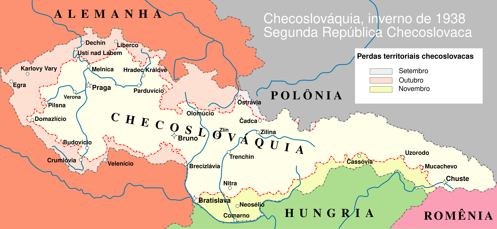

# **Classificação dos Tratados Internacionais** 📜

Esta aula trata das classificações dos tratados internacionais segundo diferentes critérios, sua natureza, generalidade, número de partes e imperatividade. Além disso, serão abordados conceitos fundamentais como *jus cogens* e reflexões críticas.

---

## **Introdução** 🧐

A classificação dos tratados é essencial para compreender as diferentes modalidades e seus efeitos jurídicos.  
Os tratados, como instrumentos normativos do Direito Internacional, **não possuem um único critério classificatório**, podendo ser analisados sob várias perspectivas:

- **Número de Estados-parte**
- **Amplitude e generalidade das disposições**
- **Natureza jurídica**
- **Conformidade com normas imperativas (*jus cogens*)**

---

## **1. Quanto ao número de Estados-parte** 🌍

| Tipo             | Definição                                         | Exemplo                                  |
|-----------------|--------------------------------------------------|------------------------------------------|
| **Bilateral**   | Entre duas partes (Estados ou organizações)      | Tratado Brasil–Paraguai                 |
| **Plurilateral**| Mais de duas partes, sem órgão central           | Tratado de Não Proliferação de Armas Nucleares (TNP)|
| **Multilateral**| Mais de duas partes no âmbito de uma OI          | Carta da ONU (1945)                     |

📌 **Observação:**  
Os tratados multilaterais assumem grande importância no **direito internacional contemporâneo**, pois regulam matérias de interesse geral como **direitos humanos**, **meio ambiente**, **comércio internacional** e **desarmamento**.

---

## **2. Quanto à generalidade das disposições** 📌

- **Convenções gerais** (*framework conventions*):  
  Estabelecem **princípios amplos**, que serão desenvolvidos por **protocolos complementares**.  
  **Exemplo:** Convenção-Quadro das Nações Unidas sobre Mudança do Clima (1992), que foi complementada pelo **Protocolo de Quioto (1997)** e pelo **Acordo de Paris (2015)**.
  
  > ...também conhecidas como **convenções-quadro
    ou guarda-chuva**: as quais estabelecem normas e princípios gerais
    que serão detalhados posteriormente por meio de tratados
    internacionais específicos, por meio de protocolos adicionais ou
    mesmo por meio de legislação interna; geralmente são utilizados em
    situações de difícil consenso político entre as partes (meio
    ambiente, saúde, minorias, entre outros)\" [@accioly_manual_2023
    p. 153]

- **Convenções específicas**:  
  Tratam de maneira **exaustiva e completa** determinado tema, dispensando instrumentos adicionais.  
  **Exemplo:** Convenção de Viena sobre Relações Diplomáticas (1961).
  
  > ...adotam de forma detalhada
    normas jurídicas específicas sobre o tema regulado, com o objetivo
    de esgotar em seu próprio instrumento tal regulação\"
    [@accioly_manual_2023 p. 153]

---

## **3. Quanto à natureza jurídica ⚖️**

Refere-se à natureza jurídica das normas consolidadas no tratado. Aqui,
há duas subclassificações possíveis, em função do que segue:

### 3.1) Quanto à imperatividade da norma 🚨

- **Tratado de direito dispositivo:** normas podem ser derrogadas por
    meio de tratado posterior;

- **Tratado de direito cogente (*jus cogens*):** as **normas
    imperativas de direito internacional geral** sobre matérias cuja
    natureza não comportaria derrogação mesmo diante de acordo
    formalizado em sentido diverso.
    
---
    

  
<b>Para saber mais: <i>Jus cogens</i></b>

  
**Artigo 53 – Convenção de Viena (1969)**  
"É nulo um tratado que, no momento de sua conclusão, conflite com uma norma imperativa de Direito Internacional geral (*jus cogens*). Para os fins da presente Convenção, uma norma imperativa de Direito Internacional geral é uma norma aceita e reconhecida pela comunidade internacional dos Estados como um todo, da qual nenhuma derrogação é permitida e que só pode ser modificada por uma nova norma de Direito Internacional geral, com o mesmo caráter" [@brasil_decreto_2009].
  

#### ✅ **Exemplos de normas *jus cogens***
- Proibição da escravidão  
- Proibição da tortura  
- Proibição da agressão armada  
- Princípio da autodeterminação dos povos  
    
---

### 3.2) Quanto ao tipo de interesse juridicamente regulado:

- **Tratados-contratos**  
  Regulam **interesses recíprocos** entre as partes, estabelecendo direitos e deveres geralmente bilaterais.  
  **Exemplo:** tratados de fronteira, como o Tratado de Petrópolis (1903).

- **Tratados-normativos**  
  Estabelecem **normas gerais de conduta** aplicáveis a todos os Estados-partes.  
  **Exemplo:** tratados de direitos humanos, como o **Pacto Internacional sobre Direitos Civis e Políticos (1966)**.

---

## **Crítica e Discussão** 🧠

Apesar de serem instrumentos centrais do Direito Internacional, os tratados não são uniformemente interpretados e aplicados pelos Estados.  
A classificação, embora útil, **não elimina os problemas práticos**, como:
- A **fragmentação do direito internacional**, com tratados sobrepostos e divergentes.
- A tensão entre **soberania estatal e normas imperativas**.
- O **déficit democrático** nos processos de negociação e ratificação, especialmente em tratados multilaterais.

📌 **Questão para reflexão:**  
Será que a multiplicação de tratados multilaterais garante maior cooperação ou gera um sistema internacional mais complexo e menos eficiente?

---

## **Resumo da Aula** ✅

📌 **O que vimos hoje:**
- **Critérios de classificação dos tratados**:  
  - Número de partes (**bilateral, plurilateral, multilateral**)  
  - Generalidade (**convenções gerais e específicas**)  
  - Natureza jurídica (**contratos e normativos**)  
  - Conformidade com normas imperativas (**jus cogens**)  
- **Importância do Artigo 53 da Convenção de Viena**  
- **Exemplo prático**: reservas à Convenção do Genocídio  
- **Discussão crítica**: desafios contemporâneos dos tratados  

# ✅ **Condições de Validade dos Tratados** 

Para que um tratado internacional seja considerado **válido**, são necessárias as seguintes condições:

- **Capacidade das partes** (Estados ou organizações internacionais) para celebrá-lo.
- **Habilitação dos agentes** que o subscrevem.
- **Consentimento mútuo** entre as partes.
- **Objeto lícito e possível**.

---

## **1. Capacidade das partes contratantes** 🌐

::: center
### **Artigo 6 – Capacidade dos Estados para Concluir Tratados**
> Todo Estado tem capacidade para concluir tratados.
[@brasil_decreto_2009]
:::

Inicialmente, prevalecia a doutrina segundo a qual **apenas os Estados** possuíam capacidade para celebrar tratados.  
Com a **Carta das Nações Unidas (1945)**, reconheceu-se, ainda que de forma incipiente, a capacidade **das organizações internacionais**.  
Esse entendimento foi consolidado pela **Convenção de Viena sobre o Direito dos Tratados entre Estados e Organizações Internacionais ou entre Organizações Internacionais (1986)**, que trata especificamente da matéria.

📎 **Link para a Convenção de 1986**:  
[Convenção de Viena (1986) – Senado Federal](https://legis.senado.leg.br/norma/36586033/publicacao/36586052)

---

## **2. Habilitação dos agentes** 👤

Para **adotar ou autenticar** o texto de um tratado, ou para **manifestar o consentimento do Estado em obrigar-se**, o representante deve demonstrar estar devidamente autorizado por meio do **documento de plenos poderes**.

> O documento de plenos poderes indica que determinada pessoa é reconhecida pelo Estado que ela representa como detentora de competência para **negociar e assinar um tratado internacional** específico.  
[@accioly_manual_2023 p.155]

---

> ::: center
> Artigo 7
>
> Plenos Poderes
> :::
>
> 1.  Uma pessoa é considerada representante de um Estado para a adoção
>     ou autenticação do texto de um tratado ou para expressar o
>     consentimento do Estado em obrigar-se por um tratado se:
>
>     **a)**  apresentar plenos poderes apropriados; ou
>
>     **b)**  a prática dos Estados interessados ou outras circunstâncias
>             indicarem que a intenção do Estado era considerar essa pessoa
>             seu representante para esses fins e dispensar os plenos
>             poderes.
> 
---
>
> 2.  Em virtude de suas funções e independentemente da apresentação de
>     plenos poderes, são considerados representantes do seu Estado:
>
>     **a)**  os Chefes de Estado, os Chefes de Governo e os Ministros das
>             Relações Exteriores, para a realização de todos os atos
>             relativos à conclusão de um tratado;
>
>     **b)**  os Chefes de missão diplomática, para a adoção do texto de um
>             tratado entre o Estado acreditante e o Estado junto ao qual
>             estão acreditados;
>
>     **c)**  os representantes acreditados pelos Estados perante uma
>             conferência ou organização internacional ou um de seus órgãos,
>             para a adoção do texto de um tratado em tal conferência,
>             organização ou órgão.
>
> [@brasil_decreto_2009]

---

📌 **No caso das organizações internacionais**:  
A competência para concluir tratados geralmente está prevista no **tratado constitutivo da organização**, com regras próprias para vinculação jurídica.  
[@accioly_manual_2023 pp.155-156]

---

## **3. Consentimento mútuo** 🤝

O tratado é **acordo de vontades**, formalizado pelo consentimento expresso:

> ::: center
> Artigo 9
>
> Adoção do Texto
> :::
>
> 1.  A adoção do texto do tratado efetua-se pelo consentimento de todos
>     os Estados que participam da sua elaboração, exceto quando se
>     aplica o disposto no parágrafo 2.
>
> 2.  A adoção do texto de um tratado numa conferência internacional
>     efetua-se pela maioria de dois terços dos Estados presentes e
>     votantes, salvo se esses Estados, pela mesma maioria, decidirem
>     aplicar uma regra diversa.
>
> [@brasil_decreto_2009]

---

## **4. Objeto lícito e possível** ✔️

Assim como no direito interno, o objeto deve ser **lícito** e **materialmente possível**.  
Exemplo clássico:  
O **Acordo de Munique (1938)**, pelo qual Reino Unido, França, Alemanha e Itália negociaram a entrega dos Sudetos à Alemanha sem participação da Checoslováquia — situação contestada juridicamente e politicamente (Figuras
[1](#fig:acordo_munique){reference-type="ref"
reference="fig:acordo_munique"} e
[2](#fig:particao_checoslovaquia){reference-type="ref"
reference="fig:particao_checoslovaquia"}).

---

{#fig:acordo_munique width="85%"}

---

{#fig:particao_checoslovaquia width="85%"}

---

# **Efeitos em Relação a Terceiros** 🔍

::: center
### **Artigo 34 – Regra Geral**
> Um tratado não cria obrigações nem direitos para um terceiro Estado sem o seu consentimento.  
[@brasil_decreto_2009]
:::

---

📌 **Princípio:** *res inter alios acta aliis neque nocere neque prodesse potest*  
(um ato entre partes não prejudica nem beneficia terceiros).

**Exceções e consequências:**

  1. Se os efeitos forem **nocivos**, o Estado lesado pode protestar e buscar reparação.

  2. Se forem **favoráveis**, os contratantes podem **conceder direitos** a terceiros por manifestação expressa (Arts. 36 a 38 da     Convenção).  
  [@accioly_manual_2023 p.157]

---

# **Assinatura, Ratificação e Reservas** ✍️

::: center
### **Artigo 11 – Meios de Manifestar Consentimento**
> O consentimento de um Estado em obrigar-se pode ocorrer por assinatura, troca de instrumentos, ratificação, aceitação, aprovação ou adesão, ou por outros meios acordados.  
[@brasil_decreto_2009]
:::

---

### **Assinatura**
- Geralmente **não vincula juridicamente** o Estado, possuindo valor **político** e não jurídico.  
[@accioly_manual_2023 p.159]

> Em regra, a simples assinatura não vincula juridicamente um estado ao
> tratado internacional. A assinatura por si só possui um sentido muito
> mais político do que jurídico: apresenta o estado simbolicamente como
> um ator que concorda com a importância do que foi discutido -- ainda
> que a ele não se vincule no futuro. E ainda que não tenha participado
> da negociação. A assinatura funciona assim mais como um atestado de
> que o texto final corresponde fielmente ao que foi discutido pelos
> estados durante o período de negociação -- e, por isso mesmo, ela não
> tem o papel de vincular juridicamente o estado [@accioly_manual_2023
> p. 159].

### **Ratificação**
- Em regra, a vinculação ocorre pela **ratificação**, ato do Chefe de Estado condicionado à **aprovação legislativa** (CF/88: Arts. 49, I e 84, VIII).  
- Formaliza-se pelo **depósito da carta de ratificação** ou troca de instrumentos equivalentes.

---

> (E)m regra,[^1] a vinculação jurídica de um estado a um tratado apenas
> ocorre por meio da ratificação. Esta consiste em um ato administrativo
> mediante o qual o chefe de estado confirma tratado firmado em seu nome
> ou em nome do estado, declarando se submeter ao regime jurídico ali
> disposto [@accioly_manual_2023 p. 159].

Normalmente, a ratificação (pelo chefe do Poder Executivo) fica
condicionada à **aprovação** do tratado pelo Poder Legislativo. No caso
da Constituição Federal de 1988:

> **Art. 84.** Compete privativamente ao Presidente da República:\
> (\...)\
> **VIII -** celebrar tratados, convenções e atos internacionais, sujeitos a
> referendo do Congresso Nacional;

E ainda:

> **Art. 49.** É da competência exclusiva do Congresso Nacional:\
> **I -** resolver definitivamente sobre tratados, acordos ou atos
> internacionais que acarretem encargos ou compromissos gravosos ao
> patrimônio nacional;

O direito internacional não prescreve forma necessária à ratificação.
Normalmente, contudo, ela ocorre por meio do depósito da **carta de
ratificação** junto ao organismo multilateral pertinente, ou pela sua
troca por outro documento idêntico, produzido pela outra parte
contratante. Tal documento, assinado pelo Chefe de Estado e Ministro das
Relações Exteriores, contém a promessa de que o tratado será cumprido
inviolavelmente, mas é a troca em si, que expressa o consentimento, o
que torna o tratado perfeito e acabado.

---

## **Reservas** ⚠️

> A reserva é um ato unilateral pelo qual o Estado **afasta ou modifica a aplicação de determinada disposição** do tratado em relação a si próprio.  
[@accioly_manual_2023 p.162]

---

::: center
### **Artigo 19 – Formulação de Reservas**
> Um Estado pode formular reserva ao assinar, ratificar ou aderir, salvo se:  
> **a)** a reserva for proibida pelo tratado;  
> **b)** só puderem ser formuladas reservas específicas (e esta não estiver entre elas);  
> **c)** a reserva for incompatível com o objeto e a finalidade do tratado.  
> [@brasil_decreto_2009]
:::

📌 **Parecer da CIJ (1951) – Caso das reservas à Convenção do Genocídio**  
Reconheceu-se que Estados podem **objetar a reservas incompatíveis com o objeto e a finalidade do tratado**, considerando o reservante como não parte.

---

  
<b>Para saber mais: Caso das Reservas à Convenção do Genocídio (CIJ, 1951)</b>

  
Após a adoção da **Convenção do Genocídio (1948)**, alguns Estados apresentaram **reservas**, por exemplo, recusando a jurisdição da CIJ para resolver disputas sobre interpretação do tratado.
 

  
A **Assembleia Geral da ONU** solicitou um parecer à Corte Internacional de Justiça para esclarecer:

  
  
 > Um Estado que formula reservas (não previstas) pode ser considerado parte do tratado? E os outros Estados podem aceitar ou rejeitar essa adesão com reservas?

  
✅ **Conclusão da CIJ:**  
  - Reservas são **permitidas**, desde que **não contrariem o objeto e a finalidade do tratado** (*object and purpose test*).  
  - Cada Estado decide se aceita ou rejeita a reserva feita por outro Estado.  
  - O núcleo de proteção do tratado, no caso a prevenção do genocídio, não pode ser comprometido.

  
📌 **Relevância:** Esse parecer é um marco na doutrina moderna das reservas e originou a regra hoje consagrada no **Artigo 19 da Convenção de Viena sobre o Direito dos Tratados (1969)**, que estabelece:

  <blockquote>
  "Uma reserva incompatível com o objeto e a finalidade do tratado não é permitida."
  </blockquote>

---

# **Interpretação dos Tratados** 📖

::: center
### **Artigo 31 – Regra Geral**
> Um tratado deve ser interpretado **de boa-fé**, segundo o sentido comum dos termos, no contexto e à luz do objetivo e da finalidade.  
[@brasil_decreto_2009]
:::

---

### **Questão do idioma**
- Em tratados bilaterais, prevalece o texto na **língua própria** de cada parte, salvo disposição em contrário.
- Nos multilaterais (ex.: ONU), vários idiomas são autênticos, o que pode gerar ambiguidades.  
[@accioly_manual_2023 p.164]

---

# **Tratados Sucessivos e Conflitos Normativos** ⚖️

- Em conflitos entre **tratados bilaterais e multilaterais**, ou entre dois multilaterais, aplica-se:
  - **Art. 103 da Carta da ONU:** prevalece a Carta em caso de conflito.
  - **Art. 53 da Convenção de Viena:** normas de *jus cogens* invalidam tratados incompatíveis.

---

# **Nulidade, Extinção e Suspensão** ❌

### **Nulidade**

**Causas:**  

- Erro, dolo, corrupção do representante.  
- Coação física ou ameaça de uso da força (Art. 52).  
- Violação de *jus cogens* (Art. 53).  
[@accioly_manual_2023 pp.166-167]

---

📌 **Exemplo histórico:**  

> HITLER,
> em mais de uma oportunidade, alegou que houvera coação quando da
> assinatura do Tratado de Versalhes, que pôs fim à primeira guerra
> mundial. Seria antes exemplo de coação o Acordo de Munique de 1938,
> relativo à cessão da região dos sudetos (Sudetenland) na antiga
> Tchecoslováquia, a tal ponto que este foi declarado nulo pela
> Grã-Bretanha e pela França em 1942
> [@accioly_manual_2023 pp. 166-167].

---

## Extinção

> As causas de extinção previstas pela Convenção correspondem, de modo
> geral, aos modos de extinção enumerados pela doutrina, ou seja: 1) a
> execução integral do tratado; 2) a expiração do prazo convencionado;
> 3) a verificação de condição resolutória, prevista expressamente; 4)
> acordo mútuo entre as partes; 5) a renúncia unilateral, por parte do
> estado ao qual o tratado beneficia de modo exclusivo; 6) a
> impossibilidade de execução; 7) a denúncia, admitida expressa ou
> tacitamente pelo próprio tratado; 8) a inexecução do tratado, por uma
> das partes contratantes; 9) a guerra sobrevinda entre as partes
> contratantes; e 10) a prescrição liberatória.
> Ainda cabe mencionar a denúncia unilateral, na hipótese de modificação
> fundamental das circunstâncias que deram origem ao tratado. Assim,
> qualquer tratado poderá ser denunciado unilateralmente à vontade livre
> da parte que dele se queira libertar, uma vez que considere
> modificadas as circunstâncias em que o tratado foi celebrado. É
> aplicável o princípio rebus sic stantibus, conforme codificado no
> artigo 62 da Convenção. Todavia, a CDI ao aceitá-la agiu com cautela,
> tanto assim que o artigo é redigido de forma negativa
> [@accioly_manual_2023 p. 167-168].

---

## **Resumo Final** ✅
- Condições de validade (capacidade, habilitação, consentimento, objeto lícito).
- Efeitos para terceiros (regra geral + exceções).
- Assinatura, ratificação e reservas (Artigos 11 e 19).
- Interpretação (Art. 31).
- Nulidade, extinção e jus cogens.

---

## **Perguntas para reflexão** 🤔
1. Como o *jus cogens* impacta a validade dos tratados?
2. Quais são as diferenças entre assinatura e ratificação?
3. Por que as reservas são consideradas um tema polêmico?

---

## **Leituras recomendadas** 📚
- [Convenção de Viena (1969) – Texto completo](https://legal.un.org/ilc/texts/instruments/english/conventions/1_1_1969.pdf)
- ACCIOLY, Hildebrando; SILVA, G.E.; CASELLA, P.B. *Manual de Direito Internacional Público*.  
- REZEK, José Francisco. *Direito Internacional Público: Curso Elementar*.  

[^1]: "Todavia, quando a assinatura for considerada pelo próprio tratado
    como definitiva, isso significa que as partes compreendem ser
    desnecessária a ratificação. A dispensa da ratificação ocorre quando
    o próprio tratado assim dispuser; nos acordos celebrados para
    cumprimento ou interpretação de tratado devidamente ratificado; nos
    acordos sobre assuntos puramente administrativos, que preveem
    eventuais modificações, como no caso de acordos de transporte aéreo;
    nos modus vivendi, que têm por finalidade deixar as coisas no estado
    em que se acham ou estabelecer simples bases para negociações
    futuras. Nos tratados sobre o meio ambiente tem surgido a prática de
    assinar tratados-base (convenções-quadro), que traçam as grandes
    linhas e que devem ser completados por protocolos ou pela
    modificação de anexos em que a ratificação pode ser dispensada.
    Nestas situações, basta a assinatura para o estado se vincular
    juridicamente ao tratado\" [@accioly_manual_2023 p. 159].